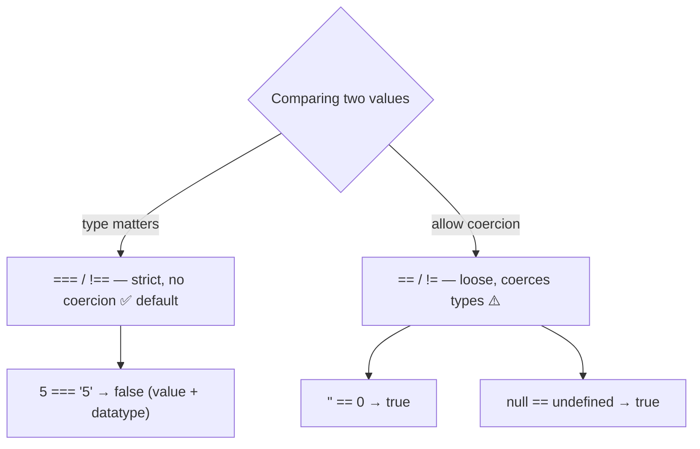

# LearnPlaywright3x — JavaScript Fundamentals & Automation Learning Repo

A learning repository tracking JavaScript fundamentals from first principles, alongside RICE-prompt notes for automation framework generation and a growing `IQ_Notes` reference library (interview-style concept explainers).

---

## Table of Contents

- [Repo Structure](#repo-structure)
- [00 — GenAI / RICE Prompting](#00--genai--rice-prompting)
- [01 — Hello World](#01--hello-world)
- [02 — `let` & Scope](#02--let--scope)
- [03 — Identifiers & Comments](#03--identifiers--comments)
- [04 — Literals & Numbers](#04--literals--numbers)
- [05 — Operators](#05--operators)
- [IQ_Notes — Reference Library](#iq_notes--reference-library)

---

## Repo Structure

```
LearnPlaywright3x/
├── 00_chaptet_GENAI/
│   └── RICEPOT_SeleniumFramworkCreation.md   # RICE-style prompt for Selenium framework gen
├── 01_chapter_Javascript/
│   └── 01_HelloWorld.js                      # console.log basics
├── 02_chapter_Javascript/
│   └── 02_let_concept.js                     # let scoping, hoisting, function declarations
├── 03_chapter_Identifier/
│   ├── 03_Identifer_Rules.js                 # valid/invalid identifier characters
│   ├── 04_Identifer_Rues_Part2.js            # naming conventions (camelCase, PascalCase, etc.)
│   ├── 05_Comments.js                        # single-line, multi-line, JSDoc comments
│   └── 06_Identifer_IQ.js                    # identifier edge cases, Unicode, keywords
├── 04_chapter_Literal/
│   ├── 07_Literal.js                         # literal types + typeof
│   ├── 08_null_undefined.js                  # null vs undefined deep dive
│   ├── 09_Null_IQ.js                         # null literal one-liner
│   ├── 10_Literal.js                         # number literal formats (hex, octal, exponent)
│   ├── 11_Number.js                          # integer/float/binary/octal/hex literals
│   └── 12_Number_Part2.js                    # numeric separators, BigInt, Infinity, NaN
├── 05_chapter_Operator/
│   ├── 13_DataType.js                        # the 7 primitive types + array/NaN
│   ├── 14_Assignment_Operator.js             # =, +=, -=, *=, /=, %=
│   ├── 15_Arithmetic_Opeartor.js             # + - * / %, ** exponent, odd/even
│   ├── 16_Comparsion_Operator.js             # ==, ===, !=, !==, >, <, >=, <=
│   ├── 17_Logical_Operators.js               # && || !  (AND / OR / NOT gates)
│   ├── 18_Confusing_Comparsion.js            # "" vs 0 vs "0" coercion, broken transitivity
│   └── 18_Confusing_Comparsion_P2.js         # null/undefined equality gotchas
└── IQ_Notes/
    ├── README.md                             # reusable prompt template for new IQ notes
    ├── Source_Code_ByteCODE_Binary_IQ.md      # source vs bytecode vs machine code
    ├── 01_Identifier_Rules.md                 # identifier rules reference
    ├── 02_Keyword_Notes.md                    # all JS reserved keywords by category
    ├── 03_commands_mac.md                     # VS Code shortcuts — macOS
    └── 03_commands_win.md                     # VS Code shortcuts — Windows
```

---

### 00 — GenAI / RICE Prompting

**Concept:** `RICEPOT_SeleniumFramworkCreation.md` is a structured prompt (Role, Instructions, Context, Example, Parameters, Output, Tone) for asking an LLM to generate an enterprise-grade Selenium + Java + Maven + TestNG framework.

**Why:** Structured prompting (RICE/RICEPOT) produces more consistent, production-quality code from an LLM than a one-line ask — it constrains scope, style, and output format up front.

**Q&A — why use this?**
- **Q: What does the prompt enforce?** A: Page Object Model with `PageFactory`, XPath-only locators, no `Thread.sleep()`, no comments in generated code, TestNG annotations.
- **Q: What target app does it automate?** A: `login.salesforce.com` — valid and invalid login test cases.
- **Q: Why ban CSS/ID selectors?** A: The prompt is testing strict XPath-only locator discipline as an enterprise standard, not a technical limitation.

```
R — Role: 15-year QA automation expert
I — Instructions: Page Object Model + PageFactory, XPath only, TestNG, no Thread.sleep()
C — Context: Salesforce login page (email, password, submit, remember-me)
E — Example: sample PageFactory class structure
P — Parameters: enterprise-grade, zero bad practice
O — Output: 1 Page Object + 2 TestNG scripts + Maven project, code-only
T — Tone: technical, precise, enterprise-grade
```

---

### 01 — Hello World

**Concept:** The smallest possible JS program — printing to the console.

**Why:** Establishes the run loop (`node file.js` → V8 → stdout) before anything else.

**Q&A — why use this?**
- **Q: What runs this file?** A: Node.js, powered by the V8 engine.
- **Q: Where does `console.log` write to?** A: stdout, via V8's console binding.
- **Q: Why start here?** A: Confirms the toolchain (Node install, file execution) works before adding logic.

```js
console.log("Hello The Testing Academy!");
```

---

### 02 — `let` & Scope

**Concept:** `let` is block-scoped, unlike `var` which is function-scoped. This file also shows hoisting behavior for function declarations.

**Why:** Understanding block scope is required before writing loops or conditionals safely — `var` in a loop leaks past the block, `let` doesn't.

**Q&A — why use this?**
- **Q: Why does `badCodeFn()` work even though it's called before its declaration?** A: Function declarations are hoisted fully (name + body) to the top of their scope.
- **Q: What would break if `let a` inside the `for` were `var a`?** A: Nothing here directly, but `var` would leak `a` out of the loop's block scope into the enclosing scope.
- **Q: Why is this file called "bad code"?** A: A 100,000-iteration `console.log` + function call per tick is a deliberate anti-pattern for demonstrating performance cost, not a real-world pattern.

```js
let a = 10;
console.log(a);

for (let a = 0; a < 100000; a++) {
    console.log(a);
    badCodeFn();
}

function badCodeFn() {
    console.log("Hello");
}
```

---

### 03 — Identifiers & Comments

**Concept:** Covers legal identifier characters, naming conventions, comment syntax, and edge cases like Unicode identifiers and reserved keywords.

**Why:** Naming rules are enforced by the parser before your code ever runs — knowing the boundaries avoids `SyntaxError`s and keeps code readable across a team.

**Q&A — why use this?**
- **Q: Can an identifier start with a digit?** A: No — `let 1stPlace` throws `SyntaxError: Invalid or unexpected token`.
- **Q: Can Unicode be used in identifiers?** A: Yes — `let café` and `let 变量` are both valid; so are `\uXXXX` escape sequences.
- **Q: What's the difference between `/* */` and `/** */` comments?** A: Both are multi-line block comments to the engine; `/** */` is the JSDoc convention used by tooling (IDEs, doc generators) to extract structured documentation.

```js
let validName = "starts with letter";
let _private = "starts with underscore";
let $jquery = "starts with dollar sign";
let café = "Unicode letter é";
let 变量 = "Chinese characters";

// let 1stPlace = "invalid"; // SyntaxError
// let class = "invalid";    // reserved keyword

/**
 *  JSDoc-style comment
 *  Author : Pramod Dutta
 */
var g = 10; // cmd + /, ctrl + /
```

Full identifier rules + naming convention tables live in [`IQ_Notes/01_Identifier_Rules.md`](IQ_Notes/01_Identifier_Rules.md).

---

### 04 — Literals & Numbers

**Concept:** A literal is a fixed value written directly in source code (`42`, `"hi"`, `true`, `null`). This chapter covers every literal type, `typeof` behavior, `null` vs `undefined`, and every JS number format (decimal, binary, octal, hex, exponential, separators, BigInt, `Infinity`/`NaN`).

**Why:** JS has exactly one `number` type (IEEE 754 double) for everything except `BigInt` — no `int`/`float`/`double` split like Java or C. Knowing the literal forms and quirks (`typeof null === "object"`, `NaN !== NaN`) prevents subtle bugs.

**Q&A — why use this?**
- **Q: Why does `typeof null` return `"object"`?** A: A long-standing JS bug from the original 1995 implementation, kept for backward compatibility.
- **Q: What's the real difference between `null` and `undefined`?** A: `undefined` means "not assigned yet" (JS sets it automatically); `null` means "intentionally empty" (a developer sets it explicitly).
- **Q: When do you need `BigInt`?** A: When an integer exceeds `Number.MAX_SAFE_INTEGER` (2^53 - 1) and precision matters — append `n` to the literal or call `BigInt(...)`.

```js
// Number formats
let decimal = 42;
let binary  = 0b1010;      // 10
let octal   = 0o52;        // 42
let hex     = 0x2A;        // 42
let exp     = 1.5e3;       // 1500
let million = 1_000_000;   // numeric separator (ES2021+)
let big     = 123456789012345678901234567890n; // BigInt

// null vs undefined
let userName;              // undefined — not yet assigned
let profilePicture = null; // null — intentionally empty
console.log(typeof userName);       // "undefined"
console.log(typeof profilePicture); // "object" (quirk)

// Special numeric values
console.log(1 / 0);        // Infinity
console.log(0 / 0);        // NaN
console.log(typeof NaN);   // "number" (quirk)
```

---

### 05 — Operators

**Concept:** Operators are the symbols that act on values — assignment (`=`, `+=`), arithmetic (`+ - * / % **`), comparison (`== === != !== > <`), and logical gates (`&& || !`). This chapter also nails down JS's 7 primitive data types and the coercion quirks that make `==` dangerous.

**Why:** Every condition, loop guard, and assertion you'll ever write in a Playwright test is built from these operators — and loose `==` coercion is the #1 source of silent bugs (`"" == 0` is `true`, `null >= 0` is `true`). Knowing when to reach for `===` is non-negotiable.

**Q&A — why use this?**
- **Q: Why prefer `===` over `==`?** A: `==` coerces types before comparing (`5 == "5"` → `true`), `===` checks value **and** type (`5 === "5"` → `false`). Use `===` by default; `==` only for the deliberate `x == null` null-or-undefined check.
- **Q: What does `%` (modulus) buy me?** A: The remainder — the classic even/odd test is `n % 2 === 0` (even) vs `n % 2 === 1` (odd).
- **Q: What's the `null >= 0` gotcha?** A: `>=` coerces `null` to `0`, so `null >= 0` is `true`, yet `null == 0` is `false` and `null > 0` is `false` — relational and equality operators use different coercion rules.



```js
// Assignment shorthands
let x = 10;
x += 5;   // 15
x *= 2;   // 30
x %= 4;   // 2   (remainder)

// Arithmetic — modulus & exponent
console.log(101 % 2);   // 1  → odd
console.log(2 ** 3);    // 8  → 2 to the power 3

// Comparison: loose vs strict
console.log(5 == "5");   // true  → == coerces "5" to 5
console.log(5 === "5");  // false → === checks value AND type

// Logical gates
let a = true, b = false;
console.log(a && b);     // false → AND
console.log(a || b);     // true  → OR
console.log(!a);         // false → NOT

// Coercion traps (why === wins)
console.log("" == 0);    // true  😬
console.log(null >= 0);  // true  🤯
console.log(null == 0);  // false
```

| Operator | Coerces types? | Use when |
|----------|:--------------:|----------|
| `===` / `!==` | No | Default — almost always |
| `==` / `!=` | Yes | Only the intentional `x == null` check |

---

## IQ_Notes — Reference Library

Concept explainers, generated on demand via the prompt template in [`IQ_Notes/README.md`](IQ_Notes/README.md) — table breakdown, code walkthrough, pipeline diagram, TL;DR.

| File | Covers |
|------|--------|
| [`Source_Code_ByteCODE_Binary_IQ.md`](IQ_Notes/Source_Code_ByteCODE_Binary_IQ.md) | Source code vs bytecode vs binary/machine code, V8 compilation pipeline |
| [`01_Identifier_Rules.md`](IQ_Notes/01_Identifier_Rules.md) | Legal identifier characters, case sensitivity, naming conventions |
| [`02_Keyword_Notes.md`](IQ_Notes/02_Keyword_Notes.md) | Every JS reserved keyword, grouped by category |
| [`03_commands_mac.md`](IQ_Notes/03_commands_mac.md) | VS Code keyboard shortcuts — macOS |
| [`03_commands_win.md`](IQ_Notes/03_commands_win.md) | VS Code keyboard shortcuts — Windows |

---

> **TL;DR:** This repo is a from-scratch JavaScript fundamentals course (`console.log` → scoping → identifiers → literals/numbers → operators) plus a `00_chaptet_GENAI` folder for LLM automation-framework prompting, backed by an `IQ_Notes` library of standalone concept references anyone can regenerate with the same prompt template.
